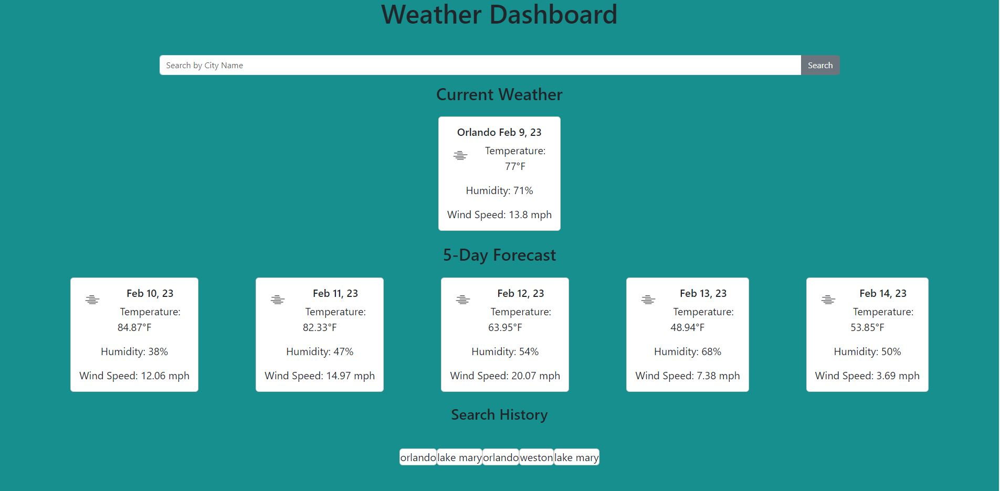

## Server-Side APIs Challenge: Weather Dashboard

# Deployed Page

https://patameglio.github.io/weather-dashboard/

# Description

This web application will show the current and 5 day forecast of the city that the user searches for.
The information it shows includes:
- date
- temperature
- humidity
- wind speed
- icon representation

The application will give you an alert if the city you searched for was not found.
It will also saved your 5 most recent searches.
If you click on one of the previous searches, it will show you the weather for it again.

# Screenshot

The webpage is not as pretty as i would have liked to made it. I struggled with getting the API's to function the way i wanted so i did not have enough time to style.